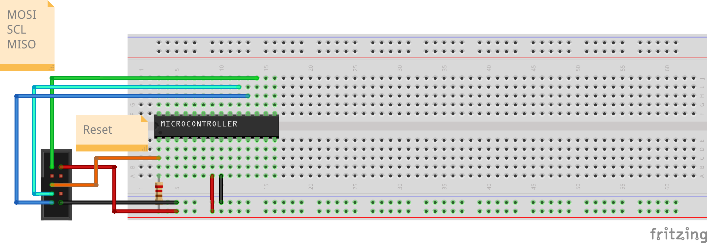

# Flash first program

We will use avrdude to flash our first program.

If you are using the USBASP programmer here is the instruction for flashing programs.

```
sudoavrdude -c usbasp -p m88pa -U flash:w:hello.hex
```

If you want to use a Raspberry Pi or Beaglebone for flashing, look at [this video here](https://www.youtube.com/watch?v=AJXOhdXllLY)


