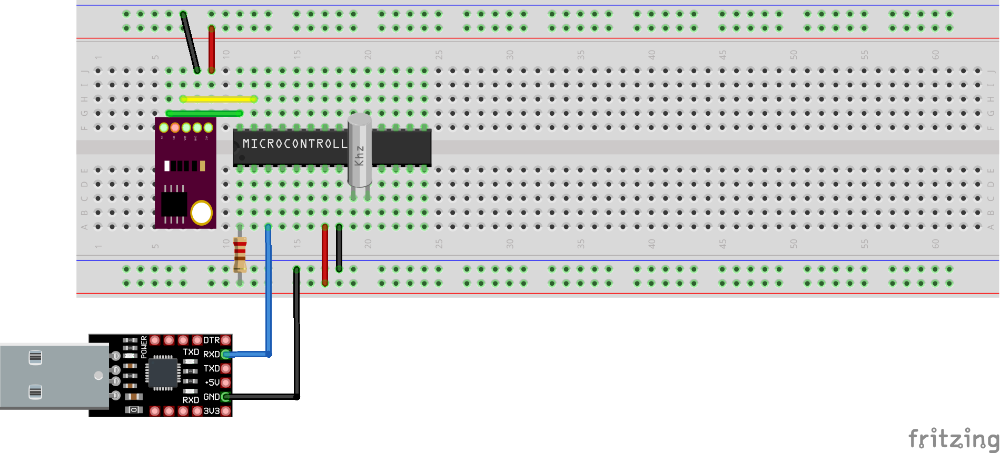

# I2C Master controlling LM75A

This example shows how to use the I2C interface of the Atmega88pa controller. It will read out the temperature of a LM75A temperature sensor. [Link to LM75A datasheet](https://www.ti.com/lit/ds/symlink/lm75a.pdf?ts=1666337457041&ref_url=https%253A%252F%252Fwww.ti.com%252Fproduct%252FLM75A)

